# Hands-on Lab: Using Git to Track and Manage Changes for a Simple Form

**Name:** Essence-Git  
**Lab Title:** Git Hands-on Lab  
**Repository Name:** simple-form  
**Tools Used:** Git Bash (Windows), Visual Studio Code  


## Introduction

This document explains, step by step, how I carried out the Git hands-on lab to track and manage changes for a simple HTML form. The purpose of this lab was to demonstrate practical Git skills such as cloning a repository, staging and committing changes, pushing and pulling updates from GitHub, reverting files, creating and merging branches, and undoing unwanted local changes.

Screenshots are included at key stages to provide evidence of the work completed.


## Step 0: Creating the Project Files in VS Code

Before using Git, I created the project files locally using Visual Studio Code.

I opened VS Code and created a new folder named `simple-form`. Inside this folder, I created two files:

- `form.html`
- `style.css`

In `form.html`, I created a simple HTML form that collects the user’s name, email address, and message.


In `style.css`, I added basic styling such as fonts, spacing, and layout to improve the appearance of the form.

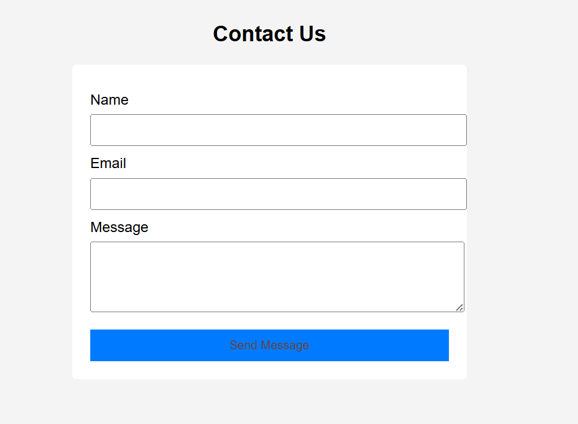

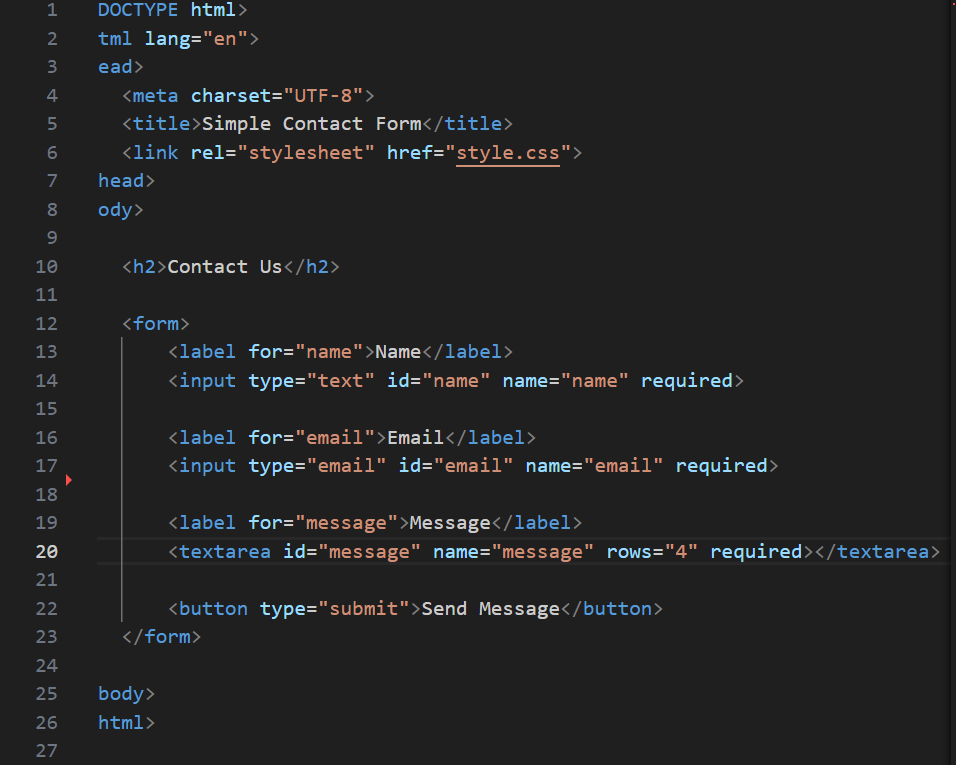

I saved both files to ensure they were ready to be tracked using Git.

I also created an empty GitHub repository named `simple-form` without adding a README or `.gitignore` file.

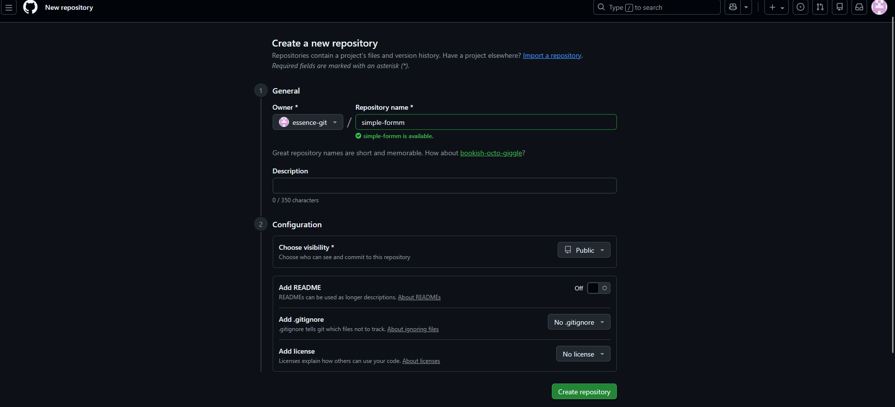


## Step 1: Clone the GitHub Repository

I cloned the existing GitHub repository to my local machine using Git Bash.

```bash
git clone https://github.com/yourusername/simple-form.git
cd simple-form
```

 
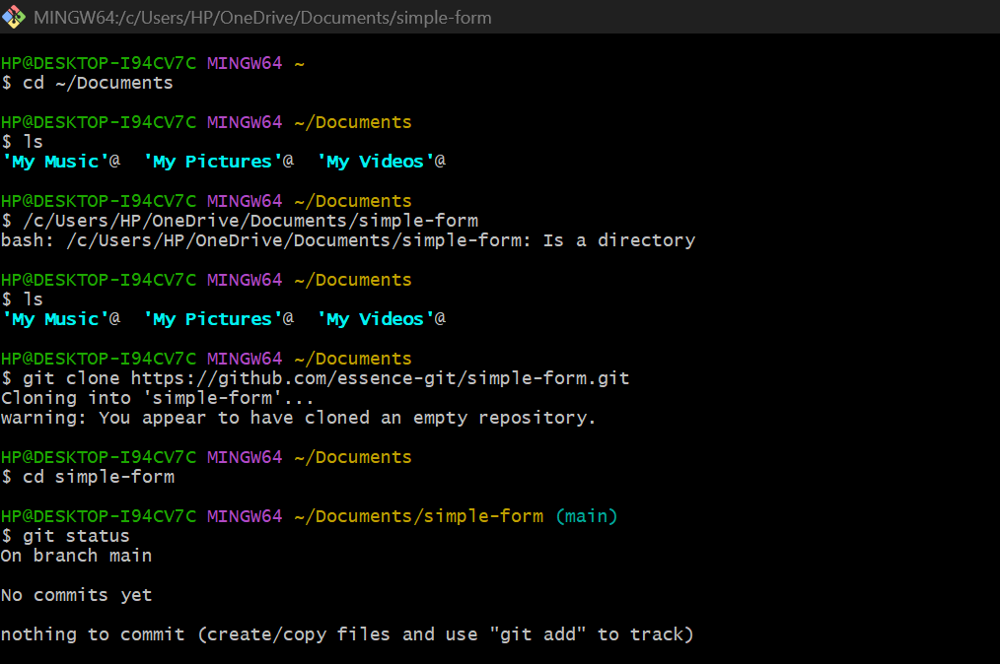

---

## Step 2: Add the HTML and CSS Files

I copied the client-provided `form.html` and `style.css` files into the `simple-form` directory and confirmed their presence using:

```bash
ls -al
```

  
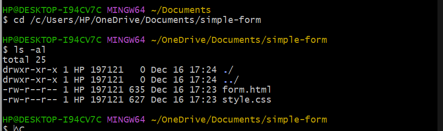


## Step 3: Stage the Form Files

I staged the files so they could be committed.

```bash
git add form.html style.css
```
 
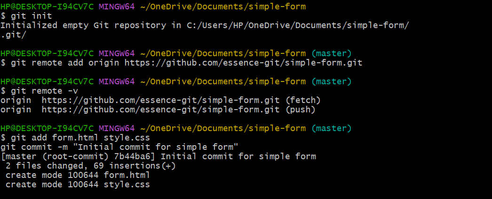

## Step 4: Commit the Initial Version

I committed the staged files with a clear message.

```bash
git commit -m "Initial commit for simple form"
```
 
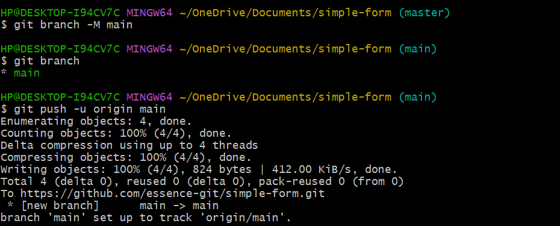

## Step 5: Push to GitHub

I pushed the initial commit to GitHub.

```bash
git push origin main
```

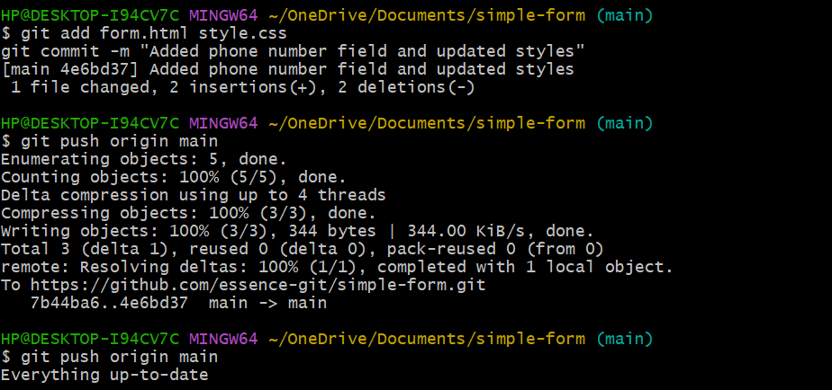

## Step 6: Make and Track Changes (Phone Number Field)

I updated `form.html` to include a phone number field and modified `style.css` to update the font styling.

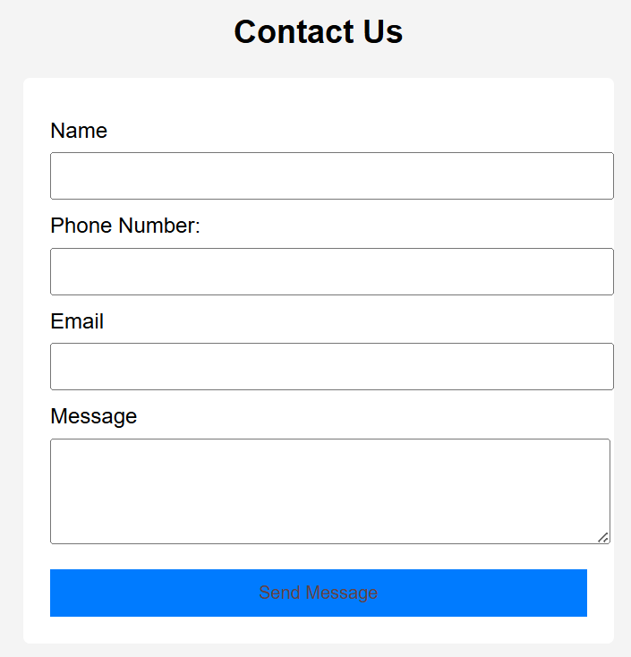

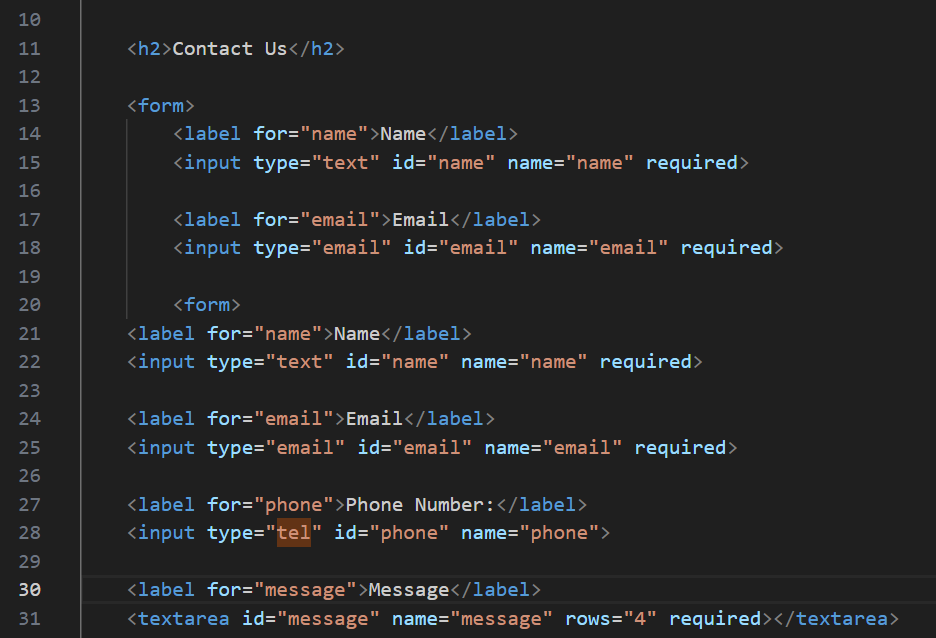


After saving the files, I staged and committed the changes.

```bash
git add form.html style.css
git commit -m "Added phone number field and updated styles"
```

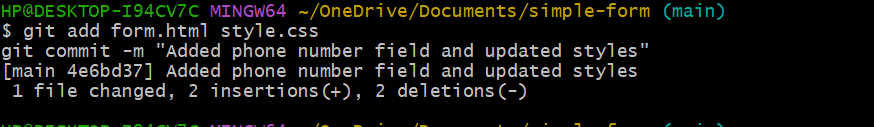

## Step 7: Push the Updated Changes

I pushed the updated commit to GitHub.

```bash
git push origin main
```


## Step 8: View Project History

I viewed the commit history using:

```bash
git log
```

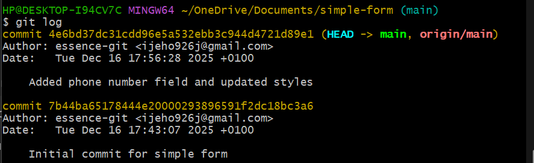

## Step 9: Revert form.html to a Previous Version

I identified a previous working commit using `git log` and reverted `form.html` to that version.

```bash
git checkout <commit-hash> -- form.html
git add form.html
git commit -m "Reverted form.html to previous working version"


```
my commit harsh was 7b44ba65178444e20000293896591f2dc18bc3a6 -- form.html

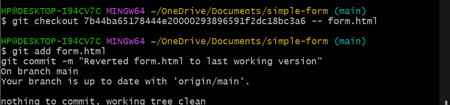
---

## Step 10: Create a Branch for CAPTCHA Feature

I created and switched to a new branch for the CAPTCHA feature.

```bash
git checkout -b feature-add-captcha
```

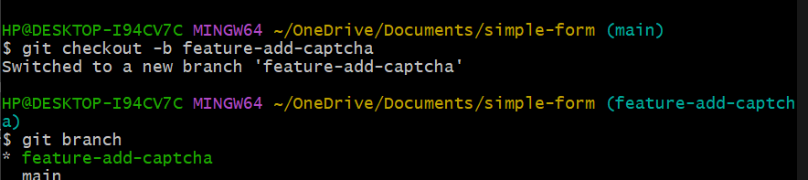


## Step 11: Add CAPTCHA Feature

I added a basic CAPTCHA placeholder to `form.html` and committed the change.

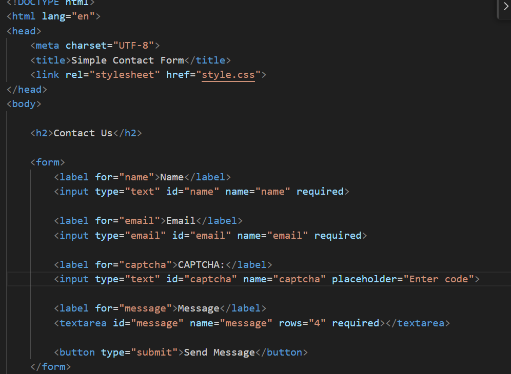

```bash
git add form.html
git commit -m "Added CAPTCHA feature"
```
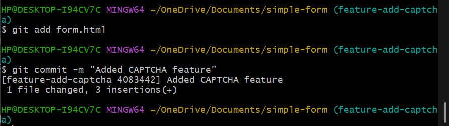

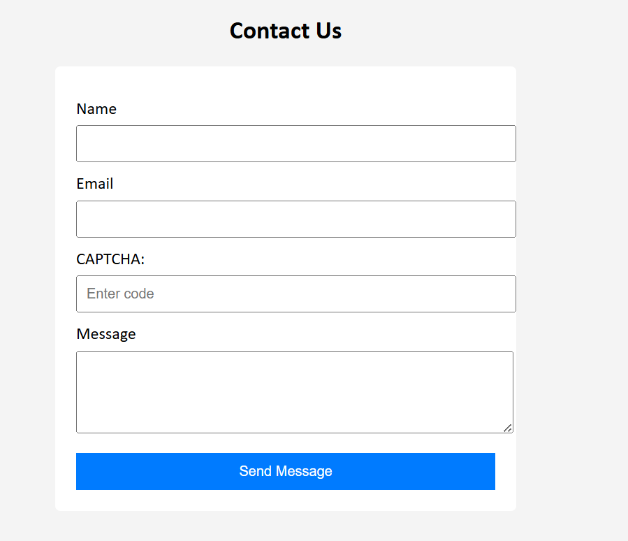
---

## Step 12: Merge CAPTCHA Feature into Main Branch

I switched back to the main branch and merged the feature branch.

```bash
git checkout main
git merge feature-add-captcha
```

## Step 13: Push Merged Changes to GitHub

I pushed the merged changes to GitHub.

```bash
git push origin main
```
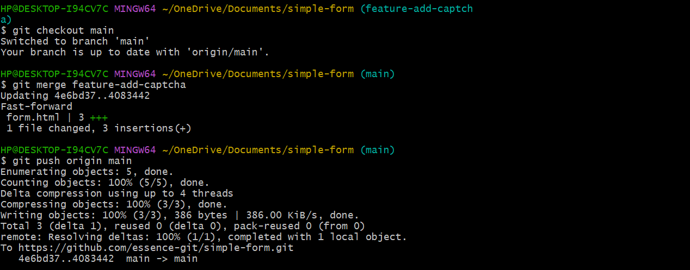

## Step 14: Undo Unwanted Local Changes

I discarded unwanted local changes made to `style.css` before committing.

```bash
git checkout -- style.css
git status
```
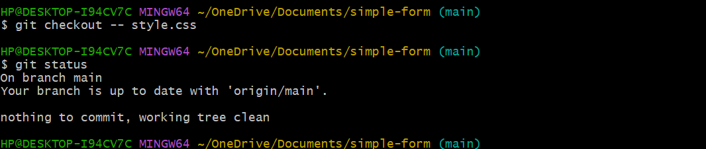

## Conclusion

Through this lab, I successfully demonstrated how to use Git to manage versions of a project, track changes using commits, revert files safely, work with branches, merge features, and synchronize a local repository with GitHub.
